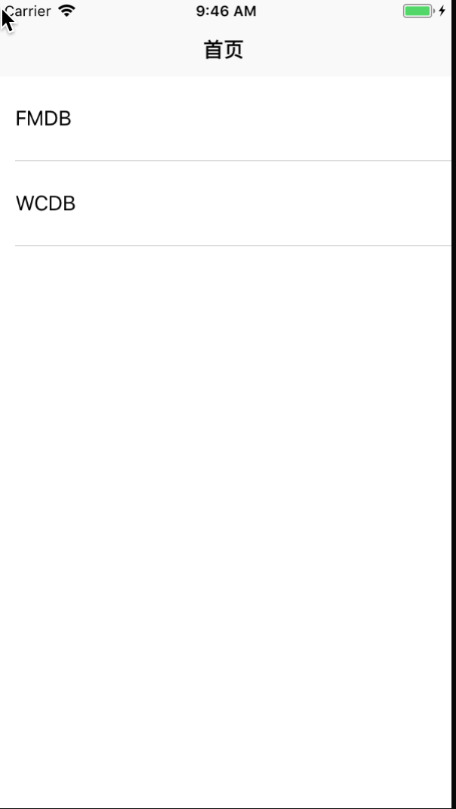
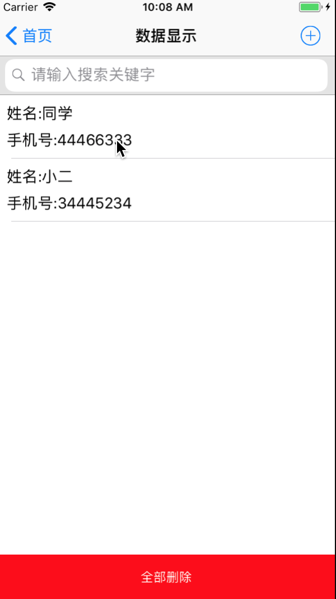

## 数据库操作
数据库操作FMDB和WCDB的封装，以及Realm数据库，增删查改，和本地搜索

* 通过创建创建单例的形式，进行创建数据库，全局可以使用

<pre>
//创建表是否成功
-(BOOL)openFMDBName:(NSString *)pathStr;

/**
 *  增加
 */
-(BOOL)insetTitle:(id)model withPath:(NSString *)pathStr;

/**
 *  删除   根据userid进行删除
 */
-(void)deleteWithTitle:(NSString *)pathStr withUserID:(NSString *)userId;

/**
 *  删除所有数据
 */
-(void)deleteWithTitle:(NSString *)pathStr;

/**
 *  更新数据   修改
 */
-(void)updateWithModel:(id)model;

/**
 *  条件查询数据
 */
-(void)selectWithTitle:(NSString *)userId withUserID:(NSString *)pathStr;

/**
 *  查询所有数据
 *
 */
-(void)selectAllMethod:(NSString *)pathStr withBlock:(void(^)(id Success))block;

//查询数据(去除重复数据)
-(NSArray *)queryDataWithTableName:(NSString *)pathStr keyword:(NSString *)keyword;
</pre>

### FMDB
通过cocoaPods进行下载

### WCDB
通过WCDB进行下载

* WCDB通过继承WCTTableCoding

> 定义绑定到数据库表的类和绑定到数据库表的字段，并设置设置主键和设置索引 
> 设置Model进行添加数据
> WCDManager进行相应的处理,增删改查

<pre>
//关闭数据库
+(void)killDB;

//添加数据
- (BOOL)insertUser:(WCDModel*)mod;

//更新所有的数据
- (BOOL)updateUser:(WCDModel*)mod;

//根据userid进行更新数据
- (BOOL)updateAgeAndUserIDWithMod:(WCDModel*)mod;

//通过model进行删除
- (BOOL)deleteUser:(WCDModel*)mod;

//删除所有
- (BOOL)deleteAllUsers;

//通过userid查询
- (WCDModel *)getUserWithId:(NSString*)userID;

//根据号查询
- (NSArray*)getUsersWithTelNum:(NSInteger)telNum;

//查询所有数据
- (NSArray*)getAllUser;

//按拼音查询  号码查询
- (NSArray *)getUserWithName:(NSString *)pinyin;
</pre>
